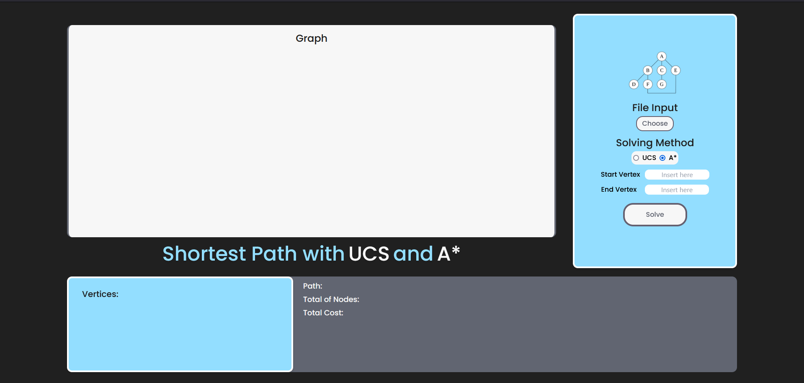
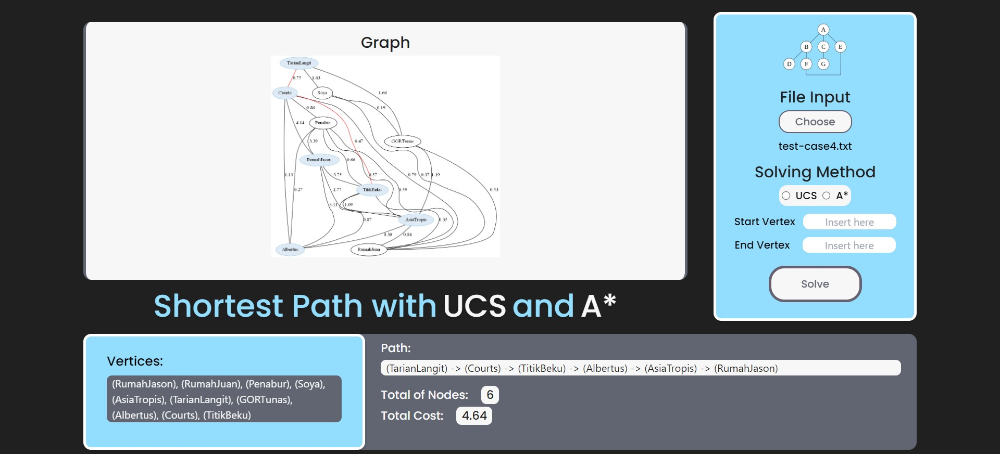

# IF2211_Strategi Algoritma

## *Tucil3_13521008_13521116*

## **Table of Contents**
* [Program Description](#program-description)
* [Required Program](#required-program)
* [How to Run The Program](#how-to-run-the-program)
* [Implementation Screenshots](#implementation-screenshots)
* [Progress Report](#progress-report)
* [Folders and Files Description](#folders-and-files-description)
* [Author](#author)

## **Program Description**
This program is a shortest-path finder for traversal graphs by implementing the uniform cost search (UCS) and A-Star (A*) algorithm for solving. The graph used by the program will be inputted from a .txt file. Users can customize the graph in the .txt file. After inputting the file, users can choose which algorithm they want to use to find the path. Users also can determine the desired start and end of the vertex they want to search. The user will get the visualization of the graph, the path from start to end of the vertex, the total of nodes, and the total of cost.

## **Required Program**
| Required Program | Reference Link|
|-------------------|-------------|
| Go (Golang)       | [Go (Golang)](https://go.dev/doc/install) |
| Tailwind CSS      | [Tailwind CSS](https://tailwindcss.com/docs/installation) |
| Graphviz          | [Graphviz](https://dominikbraun.io/blog/visualizing-graph-structures-using-go-and-graphviz/) |

## **How to Run The Program**
1. Clone this repo using this command

```sh
git clone https://github.com/Gulilil/Tucil3_13521008_13521116.git
```

2. Change the current directory into the src folder
```sh
cd Tucil3_13521008_13521116
```

3. Run the main file inside the `src` folder
```sh
go run src/main.go
```

4. Open the appplication in the web browser, using:
```
localhost:9000/
```


## **Implementation Screenshots**


Here is the display of the web when it is started. The main part of the display will be on the top-right of the screen where the graph will be displayed. 

On the top-left of the screen, displayed the tools to get input from the user. User can choose the .txt file using the `choose` button. Make sure that the .txt file is inside `test` folder. 

Below the file input, there is an input where the user can choose to pick either UCS or A* method. The default method to use will be the A* algorithm.

Next, users need to insert the desired start vertex and end vertex. THese two things are the crucial aspects for the program to solve the problems. Therefore, the user cannot click `solve` button without filling these inputs.



Here is the program display after the program find the solution of the given problem. On the bottom-right of the screen, all the vertices of the inputted graph will be displayed. 

On its right side, the solution path, the total nodes, and the total cost will be displayed. If the input is somehow incorrect or if the given problem is unsolvable, below the `path` section will be displayed `No solution found`.

## **Progress Report**

| Point | Yes | No |
|-----|-----|------|
|The program is able to calculate shortest path using UCS method| &check; |    |
|The program is able to calculate shortest path using A* method | &check; |  |
|The program is able to display the calculated solution, both the shortest path and the distance| &check; |  |
| Implemented  Bonus Aspect using Google Map API |  | &check; |


## **Folders and Files Description**
```bash                             
├── doc
    ├── Spesifikasi Tucil 3 Stima 2023.pdf
    └── Tucil_13521008_13521116.pdf
├── node_modules
├── src
    ├── frontend
        ├── assets
            ├── graph.png
            ├── output.css
            ├── solutionGraph.gv
            ├── solutionGraph.gv.png
            └── style.css
        ├── result.html
        └── index.html
    ├── backend
        ├── graph.go
        ├── io.go
        ├── queue.go
        ├── route.go
        ├── solver.go
        └── splash.go
    ├── check.go
    └── main.go
├── test
    ├── graph1.txt
    ├── graph2.txt
    ├── graph3.txt
    ├── graph4.txt
    ├── graph5.txt
    ├── test-case1.txt
    ├── test-case2.txt
    ├── test-case3.txt
    └── test-case4.txt
├── go.mod
├── go.sum
├── package-lock.json
├── package.json
├── tailwind.config.js
└── README.md
```

## **Author**
| Name | Student ID |
|-------|------------|
| Jason Rivalino | 13521008 |
| Juan Christopher Santoso | 13521116|
